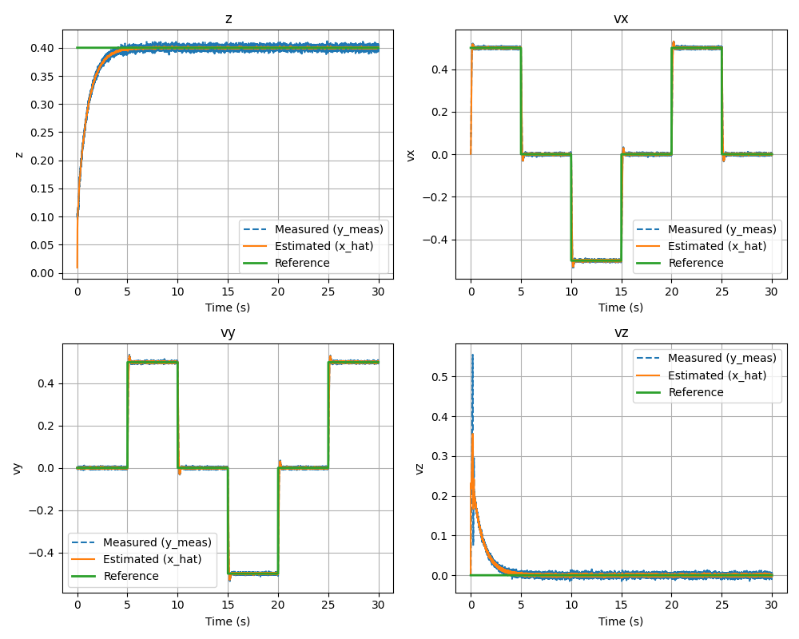
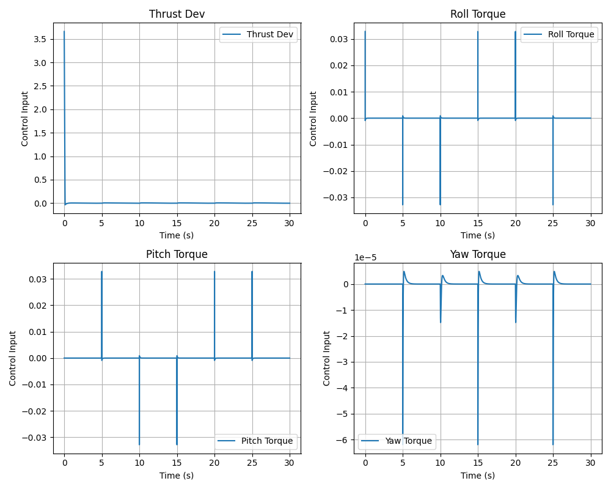
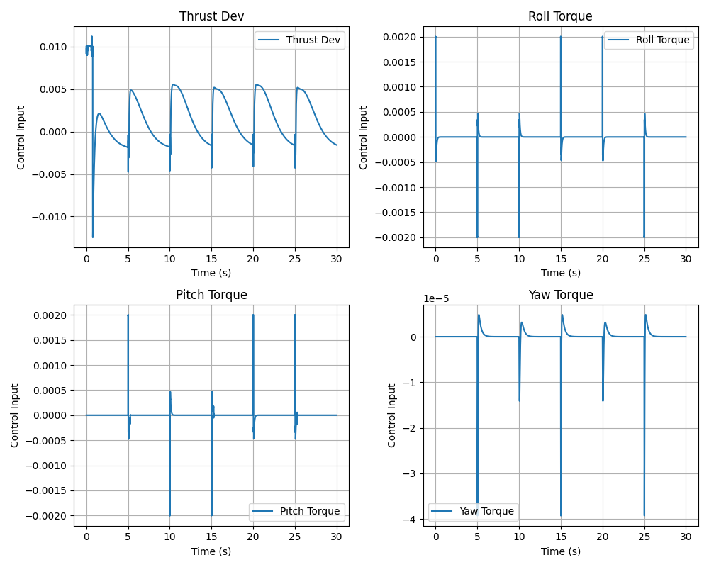
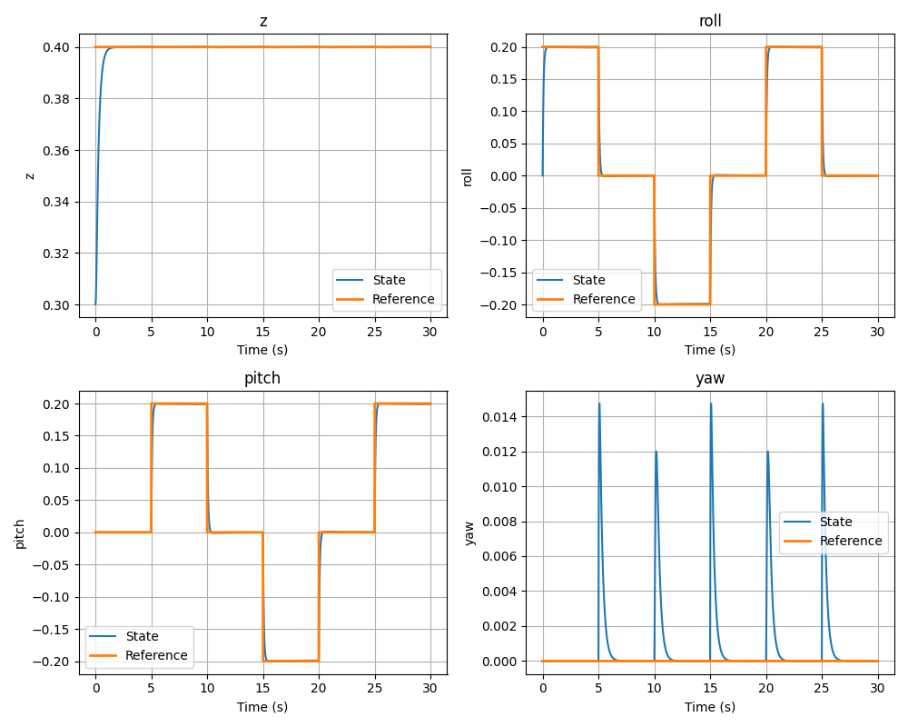
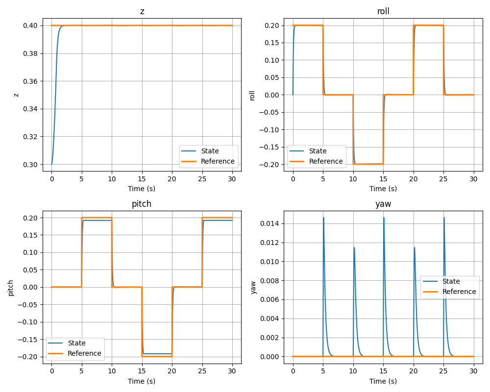

# MPC Drone Flight Controller

A Model Predictive Control (MPC) framework for quadrotor flight simulation built on top of **MuJoCo**.  
The project implements multiple MPC variants, ranging from **unconstrained batch MPC** to **constrained offset-free MPC with Kalman disturbance estimation**, all applied to a **12-state linearized hover model** of a **Crazyflie quadrotor**.

The controller linearizes the quadrotor dynamics around hover, discretizes the continuous-time model using **zero-order hold** via the matrix exponential, and solves a **receding-horizon optimal control problem** at each timestep.

---

## Repository Structure

```text
.
├── MPC/
│   ├── BatchMpc.py                  # Unconstrained batch MPC + Kalman variant
│   ├── ConstrainedBatchMPC.py       # Constrained batch MPC (QP-based) + Kalman variant
│   ├── DyPMPC.py                    # Dynamic Programming MPC + Kalman variant
│   ├── drone_environment.py         # MuJoCo quadrotor environment wrapper
│   ├── drone_params.py              # Physical parameters, linearization, state-space helpers
│   └── chaos_wind_generator.py      # Randomized wind/torque disturbance injection
├── Drone_xml/
│   ├── drone.xml                    # Crazyflie quadrotor MuJoCo model
│   └── scene.xml                    # Scene with ground plane and lighting
├── CstMPC_simple.py                 # Constrained batch MPC (no tracking, manual augmentation)
├── CstMPC_Reftrack.py               # Constrained batch MPC with integral reference tracking
├── CstMPC_Kalman_Reftrack.py        # Constrained offset-free MPC with Kalman filter
├── UnCst_Batch_droneRefTrack.py     # Unconstrained batch MPC with reference tracking
├── UnCst_Dy_KalmanRefTrack.py       # Unconstrained DP MPC with Kalman filter
└── images/                          # Saved simulation plots
```

---

## Drone Model

The simulated platform is a **Crazyflie 2.x quadrotor** modeled in MuJoCo.

The **12-state** linearized hover model uses the state vector

$$
x =
\begin{bmatrix}
x & y & z & v_x & v_y & v_z & \phi & \theta & \psi & p & q & r
\end{bmatrix}^\top
$$

where:

- $x, y, z$ are position
- $v_x, v_y, v_z$ are linear velocities
- $\phi, \theta, \psi$ are roll, pitch, and yaw
- $p, q, r$ are body angular rates

The control input is

$$
u =
\begin{bmatrix}
\Delta T & \tau_\phi & \tau_\theta & \tau_\psi
\end{bmatrix}^\top
$$

where:

- $\Delta T$ is the deviation from hover thrust
- $\tau_\phi, \tau_\theta, \tau_\psi$ are roll, pitch, and yaw torques

---

## Controller Architectures

### 1. Unconstrained Batch MPC (`BatchMpc.py`)

This controller precomputes the full receding-horizon feedback gain offline by solving the unconstrained finite-horizon quadratic program analytically:

$$
\min_U  X^\top \bar{Q} X + U^\top \bar{R} U
\quad \text{subject to} \quad
X = \Omega x_0 + \Gamma U
$$

Substituting the prediction model into the cost gives the closed-form optimal control law

$$
U^\star = K x_0
$$

with

$$
K = -\left(\Gamma^\top \bar{Q} \Gamma + \bar{R}\right)^{-1}\Gamma^\top \bar{Q}\Omega
$$

This gain is computed once during initialization and reused online.

---

### 2. Batch MPC with Integral Reference Tracking  
(`BatchMpc.py` — `BatchMPCReferenceTracking`)

To remove steady-state tracking error, the controller augments the system with integrators on selected output errors.

The integrator dynamics are

$$
z_{k+1} = z_k + \Delta t \, C_{\text{track}} \tilde{x}_k
$$

and the augmented state is

$$
x_{\text{aug}} =
\begin{bmatrix}
\tilde{x} \\
z
\end{bmatrix}
$$

where:

- $\tilde{x} = x - x_{\text{ref}}$ is the tracking error state
- $z$ is the integral of the tracked output error

This allows the controller to track outputs such as \(z\), roll, pitch, or yaw with zero steady-state error while also penalizing integral windup through the cost function.

---

### 3. Dynamic Programming MPC (`DyPMPC.py`)

This implementation solves the finite-horizon optimal control problem using the backward Riccati recursion.

Although it is equivalent to the unconstrained batch formulation, it demonstrates the dynamic programming viewpoint of MPC and provides a useful alternative implementation.

The repository also includes a Kalman-based offset-free version:

- `DyPMPCKalmanReferenceTracking`

Simulation of Drone folwwing a Square Path

<p align="center">
  
  
</p>
---

### 4. Constrained Batch MPC (`ConstrainedBatchMPC.py`)

This controller solves the constrained quadratic program online at every timestep using [`qpsolvers`](https://github.com/qpsolvers/qpsolvers) with the **OSQP** backend.

The optimization problem is

$$
\min_U \; \frac{1}{2} U^\top P U + q^\top U
$$

subject to

$$
A_{\text{ineq}} U \le b_0 + E x_0
$$

State and input constraints are assembled in condensed prediction form. Using the predicted output equation

$$
Y = \bar{C}(\Omega x_0 + \Gamma U)
$$

the controller constructs linear inequality constraints of the form

$$
A_{\text{ineq}} U \le b + E x_0
$$

This enables hard enforcement of state and actuator bounds.

---

### 5. Constrained MPC with Integral Reference Tracking  
(`ConstrainedBatchMPC.py` — `ConstrainedBatchMPCReferenceTracking`)

This variant combines:

- constrained QP-based MPC
- integral reference tracking
- physical bound handling in error coordinates

Because the optimization is performed in deviation variables, physical state bounds are automatically shifted relative to the current reference $x_{\text{ref}}$, so that the constraints remain consistent in the tracking-error formulation.   

Here we can see the plots of input constraints **without and with input constraints**

<p align="center">
  
  
</p>

As we can see below the perfromace of the controller is not much affected and the tracking is still satisfies the tracking and when the _**state constraint is applied on the pitch the controller obyed that along with not affecting the tracking of othere states**_
<p align="center">
  
  
</p>


---

### 6. Constrained Offset-Free MPC with Kalman Filter  
(`ConstrainedBatchMPC.py` — `ConstrainedBatchMPCKalmanReferenceTracking`)

This is the most complete controller in the repository.

It augments the system with a disturbance model and uses a **steady-state Kalman filter** to estimate unmeasured constant disturbances, enabling **offset-free tracking** under persistent model mismatch or external disturbances.

The disturbance-augmented model is

$$
x_{k+1} = A x_k + B u_k + B_d d_k
$$

$$
d_{k+1} = d_k
$$

$$
y_k = C_y x_k + v_k
$$

At each timestep, the controller performs the following sequence:

1. **Kalman correction**  Update the estimate
   
$$
\left[
\begin{array}{c}
\hat{x} \\
\hat{d}
\end{array}
\right]
$$

using the latest measurement $y_k$

3. Solve Steady-state target to obtain the steady-state target $(x_s, u_s)$

4. **Constrained QP in deviation coordinates**  
   Solve for

$$
\tilde{u} = u - u_s
$$

   using deviation dynamics based on

$$
\tilde{x} = x - x_s
$$

5. **Apply control**

$$
u = u_s + \tilde{u}
$$

6. **Kalman prediction**  
   Propagate the estimator forward to the next timestep

This structure gives robust tracking performance even in the presence of persistent disturbances such as wind or modeling error.

---


